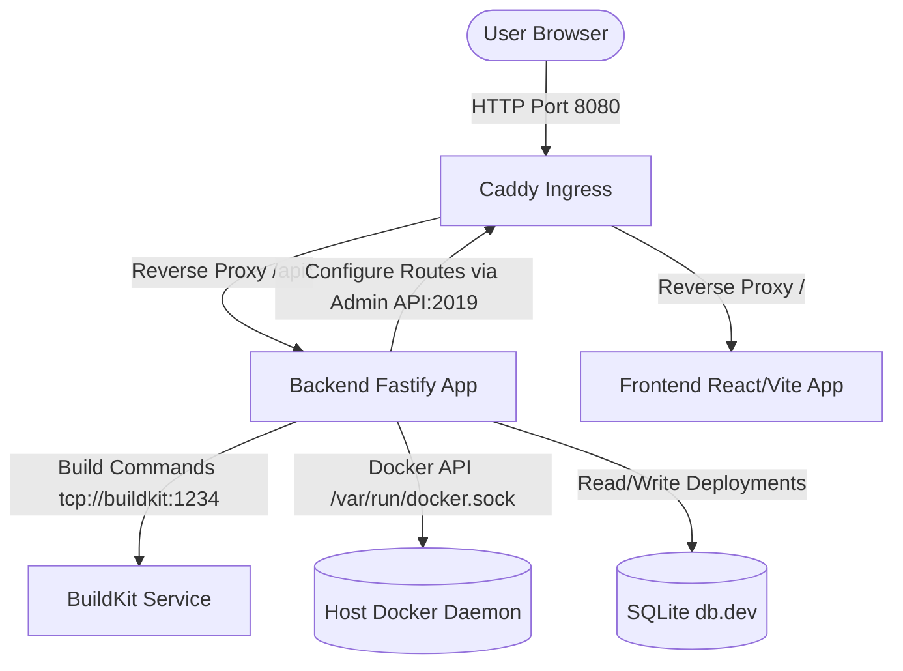

# 🚀 Brimble Startup & Running Guide

This guide details how to launch and run the **Brimble** deployment platform.

---

## 🏗️ Architectural Overview

Brimble is a containerized self-hosted deployment platform orchestrated with **Docker Compose**. It consists of four main services:



1. **Frontend (React + Vite + Tailwind CSS v4 + TanStack Query)**
   - Elegant dashboard running on port `5173`.
   - Handles repository creation, live build log streaming, and deployment control.
2. **Backend (Fastify + TypeScript + Prisma + SQLite)**
   - Runs on port `3001`.
   - Listens to log streams, triggers isolated container builds, and manages database states.
   - Interacts with Caddy's Admin API (`2019`) to dynamically register subdomains.
   - Binds to `/var/run/docker.sock` to control active containers.
3. **Caddy Ingress Router**
   - Binds to host port `8080:80`.
   - Acts as the gateway routing requests:
     - `/api/*` goes to the `backend` container.
     - Everything else goes to the `frontend` container.
     - Dynamically manages routing configurations for newly deployed customer containers (e.g., matching a generated hostname/subdomain to the deployed container's port).
4. **BuildKit Daemon**
   - High-performance isolated container builder. Runs in privileged mode to carry out builds dynamically.

---

## 🛠️ Step-by-Step Launch Guide

To run Brimble, you need **Docker** and **Docker Compose** installed on your host system.

### Step 1: Navigate to the Brimble Workspace Directory
Open your terminal and navigate to the project directory:
```bash
cd /home/user/Documents/brimble/brimble
```

### Step 2: Spin Up the Infrastructure
Start the Docker Compose services in the foreground to watch live logs and ensure everything initializes successfully:
```bash
docker compose up --build
```

> [!NOTE]
> If your system requires root privileges for Docker commands, prefix with `sudo`:
> ```bash
> sudo docker compose up --build
> ```

### Step 3: Verify the Services
The container setup process will automatically:
- Spin up `buildkit`, `caddy`, `backend`, and `frontend`.
- Run Prisma Client generation and SQLite database initialization (`npx prisma db push --accept-data-loss`).
- Start the live development servers for the backend and frontend.

Once the services are running, access the dashboard by navigating to:
👉 **[http://localhost:8080](http://localhost:8080)**

---

## ⚡ How it Works (Under the Hood)

1. **Create a Deployment**: In the dashboard, when you connect a repository or deploy a sample app (located in `apps/sample-app`), the backend clones/prepares the source files.
2. **Detection & Build Plan**: The backend invokes **Railpack** to inspect the source code, generate a build plan, and direct the **BuildKit** service to build a secure, lightweight runner image.
3. **Provision Container**: Once built, the backend leverages the `/var/run/docker.sock` mount to spawn the new deployment container inside the `brimble-net` network.
4. **Register Dynamic Ingress**: The backend registers the container inside Caddy's routing table (using the Caddy Admin API on port `2019`). Your newly deployed app is instantly accessible through a dynamic subdomain on `localhost`.

---

## 🔧 Troubleshooting & Common Issues

### 1. Docker Daemon Permission Denied
If you see an error like:
```
Permission denied while trying to connect to the Docker daemon socket
```
- **Solution 1**: Run the command using `sudo`: `sudo docker compose up --build`
- **Solution 2**: Add your user to the `docker` group so you don't need `sudo`:
  ```bash
  sudo usermod -aG docker $USER
  ```
  *(Log out and log back in for changes to take effect).*

### 2. Port Collisions on Port `8080` or `2019`
If `8080` (dashboard) or `2019` (Caddy admin API) is already in use by another app:
- Check what is occupying the ports:
  ```bash
  sudo lsof -i :8080
  sudo lsof -i :2019
  ```
- Either stop the occupying process or change the port bindings inside `docker-compose.yml` under the `caddy` service.
